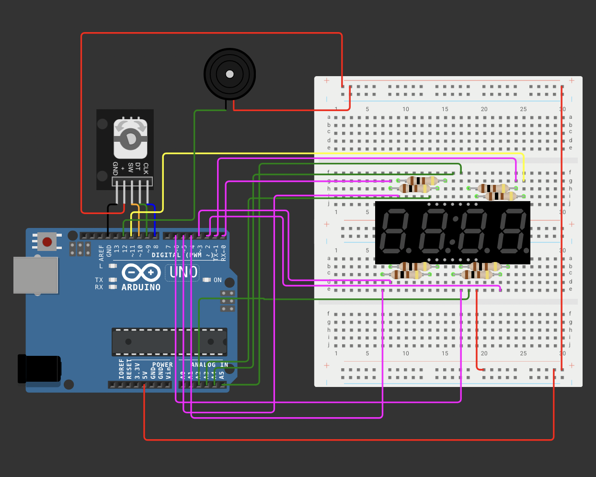
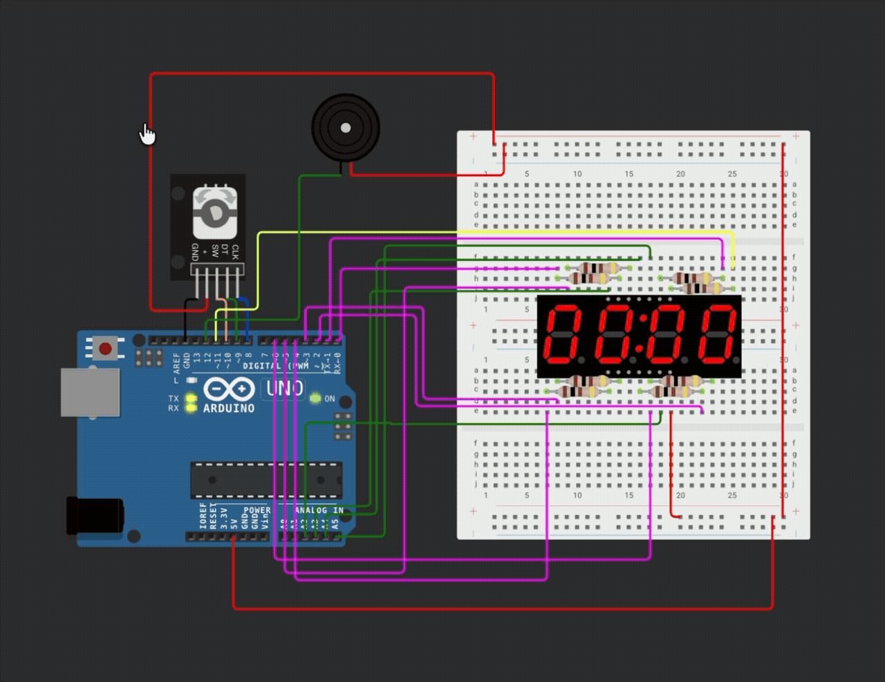

# Tarefa 3: Cronômetro

Dado o circuito abaixo, o objetivo da atividade é programar o display para funcionar
como um cronômetro simples.

## Requisitos da atividade
As palavras "DEVE(M)" — "MUST" — e "DEVERIA" — "SHOULD" — são para ser interpretadas
conforme descrito na [RFC 2119].

- [x] Ao ligar, os dígitos exibidos DEVEM ser 00:00 (com os dois pontos acesos).
- [x] O giro pelo encoder rotativo DEVE aumentar ou diminuir o tempo pelo ajuste dos segundos e,
      quando necessário, dos minutos:
  - No incremento, o tempo 00:59 DEVE se tornar 01:00 e vice-versa.
- [x] O clique no botão central DEVE iniciar a contagem regressiva.
  - Os dois pontos centrais DEVEM piscar a cada 500ms para indicar a contagem regressiva
- [x] Ao chegar no tempo 00:00, DEVE ser ativo um pino (300ms ligado) para a emissão
      de som (o pino ligado a um buzzer).

### Pontos extras
- [x] DEVERIA ser possível configurar minutos e segundos separadamente.
  - O valor sendo configurado DEVE piscar;
  - O valor fixado DEVE permanecer aceso.
- [x] O giro rápido do encoder DEVERIA avançar os números mais rapidamente que 1 a 1.

[RFC 2119]: https://datatracker.ietf.org/doc/html/rfc2119

## Resultado

